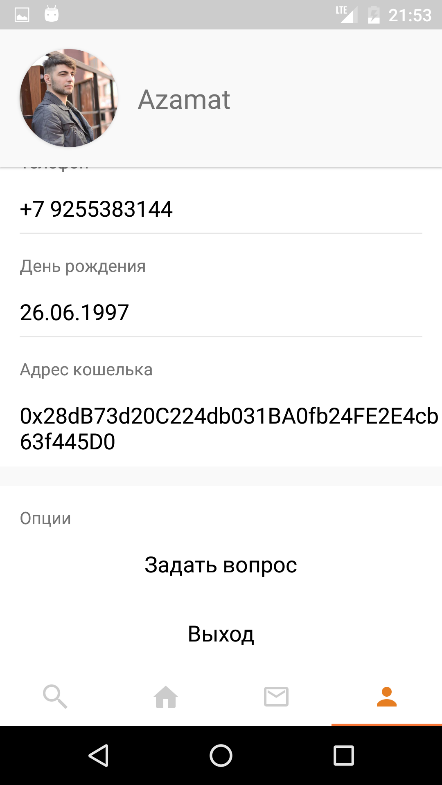
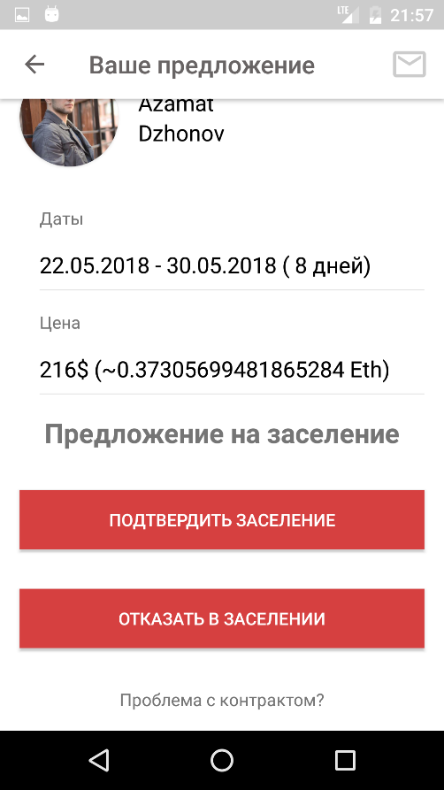
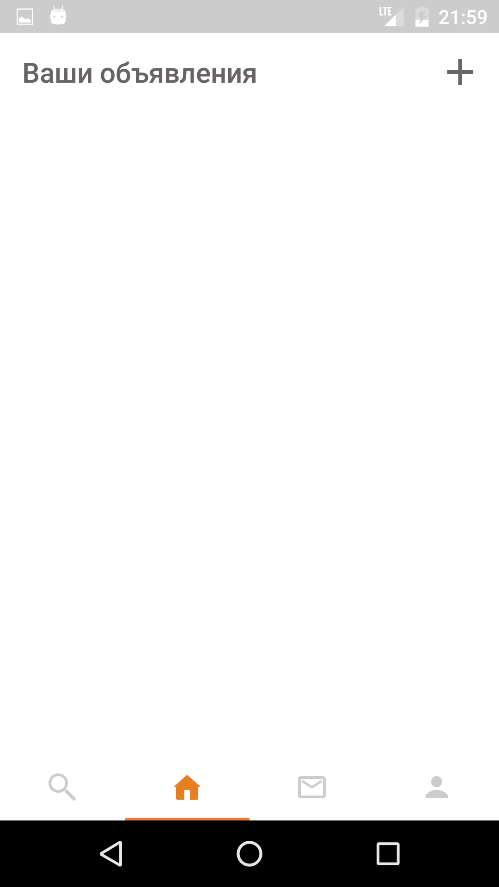

# Client application

The application use [this API](https://github.com/AplusD/decentralized-home-sharing-network-back-end)

The application screenshots:

  
   
  
  
   
  
  
   
  
  
   
  
  
   
  
  
   
  
  
   
  
  
   
  
  
   
  
  
   
  
   
  
  
   
  

